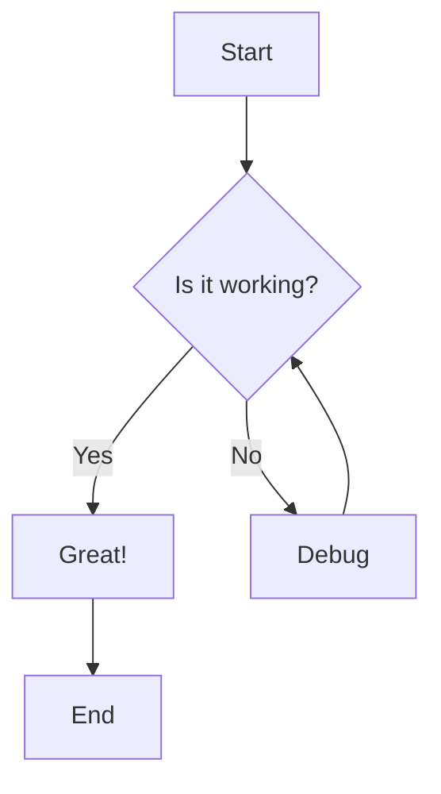
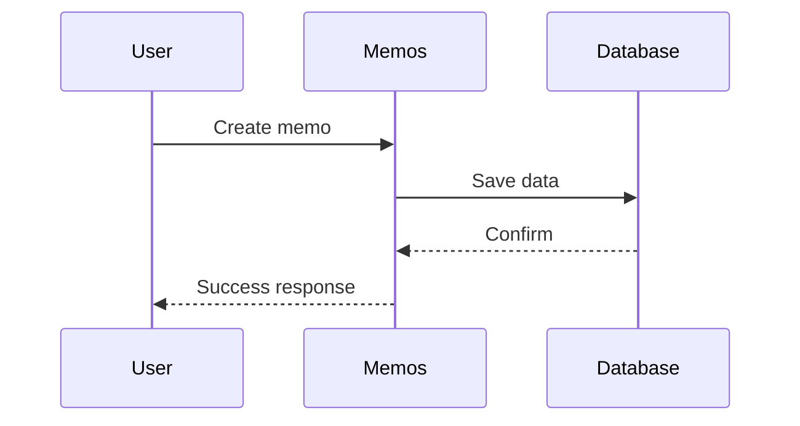

Memos supports rich content formatting through GitHub-flavored Markdown with additional enhancements. This guide covers everything from basic formatting to advanced features.

## Basic Markdown

### Text Formatting

```markdown
**Bold text** or __Bold text__
*Italic text* or _Italic text_
***Bold and italic*** or ___Bold and italic___
~~Strikethrough text~~
`Inline code`

This is a paragraph with **bold**, *italic*, and `code` text.
```

**Result:**
**Bold text**, *Italic text*, ***Bold and italic***, ~~Strikethrough text~~, `Inline code`

### Headers

```markdown
# Header 1
## Header 2  
### Header 3
#### Header 4
##### Header 5
###### Header 6
```

<Callout type="tip">
Headers automatically generate anchor links for easy linking and navigation.
</Callout>

### Lists

#### Unordered Lists

```markdown
- Item 1
- Item 2
  - Nested item
  - Another nested item
- Item 3

* Alternative syntax
+ Another alternative
```

#### Ordered Lists

```markdown
1. First item
2. Second item
   1. Nested item
   2. Another nested item
3. Third item

1. Lists can start with any number
5. The numbers don't need to be sequential
2. Markdown will auto-number them
```

#### Task Lists

```markdown
- [x] Completed task
- [ ] Incomplete task
- [x] Another completed task
  - [ ] Nested task
  - [x] Completed nested task
```

**Result:**
- [x] Completed task
- [ ] Incomplete task
- [x] Another completed task

### Links and References

#### Basic Links

```markdown
[Link text](https://example.com)
[Link with title](https://example.com "Tooltip text")

Auto-links: https://example.com
Email links: <email@example.com>
```

#### Reference Links

```markdown
[Link text][reference-id]
[Another link][1]

[reference-id]: https://example.com
[1]: https://example.com "Optional title"
```

#### Internal Links

```markdown
[Other memo](/docs/guides/getting-started)
[Specific section](/docs/guides/content-syntax#headers)
```

### Images

#### Basic Images

```markdown


```

#### Image with Link

```markdown
[](https://example.com)
```

<Callout type="info">
**Image Storage**: Upload images directly to your Memos instance or reference external URLs.
</Callout>

## Code and Syntax Highlighting

### Inline Code

```markdown
Use `const` for constant values.
File paths like `/etc/hosts` are formatted as code.
```

### Code Blocks

#### Basic Code Blocks

````markdown
```
Plain code block without syntax highlighting
```
````

#### With Syntax Highlighting

````markdown
```javascript
function greet(name) {
  return `Hello, ${name}!`;
}

const message = greet('World');
console.log(message);
```
````

#### Supported Languages

Popular languages supported:

````markdown
```bash
#!/bin/bash
echo "Shell script"
```

```python
def hello_world():
    print("Hello, World!")
```

```sql
SELECT * FROM users WHERE active = true;
```

```yaml
version: '3.8'
services:
  memos:
    image: neosmemo/memos:stable
```

```json
{
  "name": "memos",
  "version": "1.0.0"
}
```

```dockerfile
FROM alpine:latest
RUN apk add --no-cache ca-certificates
```
````

#### Code Block Features

````markdown
```javascript title="example.js"
// Code with title
const greeting = "Hello World";
```

```bash showLineNumbers
# Code with line numbers
npm install
npm start
```
````

## Advanced Formatting

### Tables

```markdown
| Column 1 | Column 2 | Column 3 |
|----------|----------|----------|
| Row 1    | Data     | More data |
| Row 2    | Data     | More data |

| Left | Center | Right |
|:-----|:------:|------:|
| L    |   C    |     R |
```

**Result:**

| Column 1 | Column 2 | Column 3 |
|----------|----------|----------|
| Row 1    | Data     | More data |
| Row 2    | Data     | More data |

### Blockquotes

```markdown
> This is a blockquote.
> 
> It can span multiple lines.

> **Note:** You can use other markdown inside blockquotes.
> 
> - Including lists
> - And other elements
```

**Result:**

> This is a blockquote.
> 
> It can span multiple lines.

### Horizontal Rules

```markdown
Three or more hyphens:
---

Three or more asterisks:
***

Three or more underscores:
___
```

## Memos-Specific Features

### Tags

Tags help organize and categorize your memos:

```markdown
#work #project #urgent
#personal #ideas
#tech #programming #javascript
```

#### Tag Best Practices

- Use lowercase for consistency
- Separate words with hyphens: `#project-alpha`
- Create hierarchies: `#work/project/alpha`
- Be specific but not overly granular

### Mentions

Reference other users or memos:

```markdown
@username mentioned in this memo
Reference another memo: [[memo-title]]
```

### Special Syntax

#### Timestamps

```markdown
Current time: {{NOW}}
Specific date: {{2025-08-19}}
```

#### Variables

```markdown
{{VARIABLE_NAME}} will be replaced with defined values
```

## Mathematical Expressions

Memos supports LaTeX-style mathematical notation:

### Inline Math

```markdown
The quadratic formula is $x = \frac{-b \pm \sqrt{b^2-4ac}}{2a}$.
```

### Block Math

```markdown
$$
\begin{aligned}
\nabla \times \vec{\mathbf{B}} -\, \frac1c\, \frac{\partial\vec{\mathbf{E}}}{\partial t} &= \frac{4\pi}{c}\vec{\mathbf{j}} \\
\nabla \cdot \vec{\mathbf{E}} &= 4 \pi \rho \\
\nabla \times \vec{\mathbf{E}}\, +\, \frac1c\, \frac{\partial\vec{\mathbf{B}}}{\partial t} &= \vec{\mathbf{0}} \\
\nabla \cdot \vec{\mathbf{B}} &= 0
\end{aligned}
$$
```

## Diagrams with Mermaid

Create diagrams using Mermaid syntax:

### Flowcharts

````markdown

````

### Sequence Diagrams

````markdown

````

### Git Graphs

````markdown
```mermaid
gitgraph
    commit id: "Initial"
    branch develop
    checkout develop
    commit id: "Feature A"
    checkout main
    commit id: "Hotfix"
    checkout develop
    commit id: "Feature B"
    checkout main
    merge develop
```
````

## Embeds and Media

### YouTube Videos

```markdown

```

### External Content

```markdown
[Embed: Website Title](https://example.com)
```

## HTML Support

Limited HTML is supported for advanced formatting:

```html
<details>
<summary>Click to expand</summary>

This content is hidden by default.

</details>

<kbd>Ctrl</kbd> + <kbd>C</kbd> for copy

<mark>Highlighted text</mark>

<sub>Subscript</sub> and <sup>Superscript</sup>
```

## Tips and Best Practices

### Writing Effective Memos

1. **Use descriptive titles** - Make memos easy to find
2. **Structure with headers** - Break up long content  
3. **Tag consistently** - Develop a tagging strategy
4. **Link related content** - Create connections between memos

### Performance Tips

1. **Optimize images** - Use appropriate file sizes
2. **Limit large tables** - Break into smaller sections
3. **Moderate math expressions** - Complex formulas can slow rendering

### Accessibility

1. **Use alt text for images** - Describe images for screen readers
2. **Meaningful link text** - Avoid "click here" links
3. **Proper heading hierarchy** - Use h1, h2, h3 logically
4. **High contrast** - Ensure text is readable

<Callout type="success" title="Pro Tip">
Use the preview mode while editing to see how your content will render before saving!
</Callout>

## Quick Reference

### Common Shortcuts

| Element | Syntax |
|---------|--------|
| Bold | `**text**` |
| Italic | `*text*` |
| Code | `` `text` `` |
| Link | `[text](url)` |
| Image | `` |
| Header | `# text` |
| List | `- item` |
| Task | `- [x] done` |
| Tag | `#tag` |
| Quote | `> text` |

### Advanced Features

| Feature | Syntax |
|---------|--------|
| Table | `\| col \| col \|` |
| Code block | ```` ```lang ```` |
| Math inline | `$formula$` |
| Math block | `$$formula$$` |
| Mermaid | ```` ```mermaid ```` |
| HTML | `<tag>content</tag>` |

---

Ready to put your formatting skills to practice? Create a new memo and experiment with different syntax elements. Check out the [keyboard shortcuts guide](/docs/guides/shortcuts) to speed up your writing workflow!